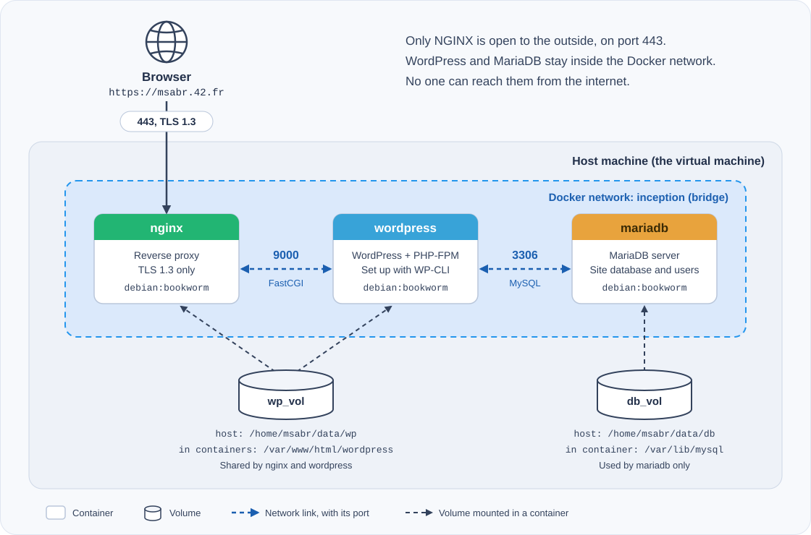
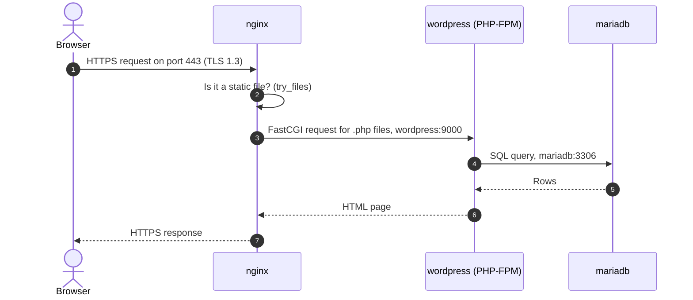
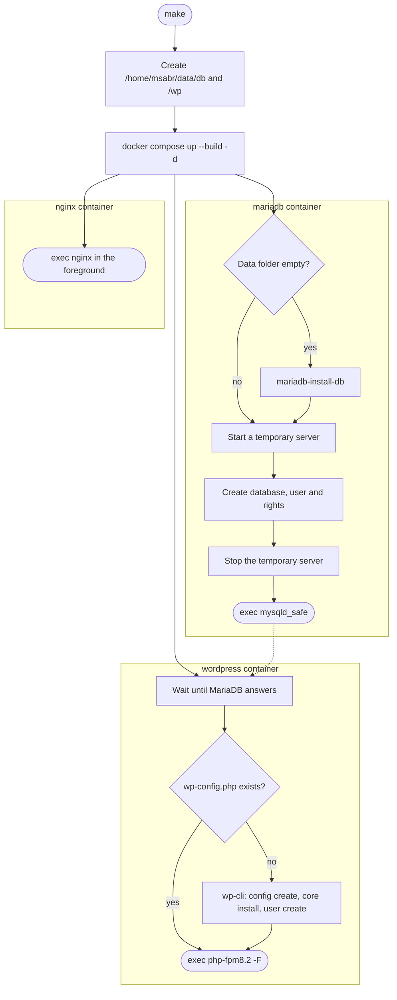
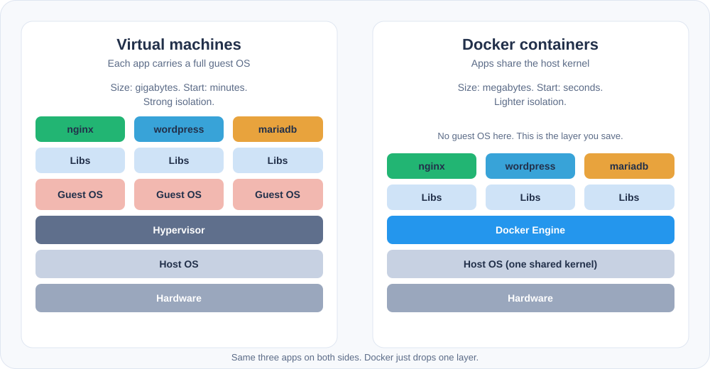

*This project has been created as part of the 42 curriculum by msabr.*

<p align="center">
  
</p>

<p align="center">
  
  
  
  
  
  
</p>

<p align="center">
  <a href="#description">Description</a> •
  <a href="#architecture">Architecture</a> •
  <a href="#instructions">Instructions</a> •
  <a href="#project-description">Project description</a> •
  <a href="#troubleshooting">Troubleshooting</a> •
  <a href="#resources">Resources</a>
</p>

---

## Description

**Inception** is a system administration project from the 42 curriculum.

The goal is simple. Build a small web infrastructure with Docker. Do it inside a virtual machine. Write every Dockerfile by hand. Pull no ready-made images.

The result is a working WordPress website. It runs on three containers:

| Service | Container | Image | Base | Port | Job |
|---|---|---|---|---|---|
| **NGINX** | `nginx` | `nginx:nginx` | `debian:bookworm` | `443` (open to the outside) | HTTPS front door. TLS 1.3 only. |
| **WordPress** | `wordpress` | `wordpress:wordpress` | `debian:bookworm` | `9000` (inside only) | WordPress and PHP-FPM. |
| **MariaDB** | `mariadb` | `mariadb:mariadb` | `debian:bookworm` | `3306` (inside only) | The site database. |

**Highlights**

- 🔒 The site is only reachable over **HTTPS on port 443**. Port 80 is closed.
- 🧱 **One service per container.** Each has its own Dockerfile.
- 🌐 One **Docker network** links the containers. They find each other by name.
- 💾 Two **named volumes** keep the website files and the database on the host, in `/home/msabr/data`.
- ♻️ Containers **restart** if they crash.
- 🤖 WordPress installs itself on first start with **WP-CLI**. No setup page.
- 🛠️ One `Makefile` builds, starts, stops and cleans everything.

---

## Architecture

<p align="center">
  
</p>

### What happens when you open the site



NGINX does not run PHP. It sends `.php` requests to PHP-FPM in the WordPress container. It finds that container by its name, `wordpress`. Docker's built-in DNS makes this work.

### What happens when you run `make`



Every script ends with `exec`. The service takes over as **PID 1**, so Docker can stop it cleanly. The scripts are safe to run again: they skip any step that is already done.

---

## Instructions

### Requirements

- A Linux virtual machine (the subject asks for one)
- [Docker Engine](https://docs.docker.com/engine/install/) with the Compose plugin
- `make` and `sudo`

### Quick start

```bash
# 1. Get the code
git clone <your-repo-url> inception
cd inception

# 2. Point the domain to your machine
echo "127.0.0.1 msabr.42.fr" | sudo tee -a /etc/hosts

# 3. Create your settings file, then edit it
cp srcs/.env.example srcs/.env
nano srcs/.env

# 4. Build and start everything
make
```

Now open **https://msabr.42.fr**. Your browser will warn you about the certificate. This is normal. The certificate is self-signed. Accept it and continue.

| Page | URL |
|---|---|
| Website | `https://msabr.42.fr` |
| Admin panel | `https://msabr.42.fr/wp-admin` |

### Settings (`srcs/.env`)

Copy `srcs/.env.example` to `srcs/.env` and change the values.

| Variable | What it is |
|---|---|
| `DB_NAME` | Name of the WordPress database |
| `DB_USER` | Database user for WordPress |
| `DB_USER_PASS` | Password of that database user |
| `URL` | Site address, for example `https://msabr.42.fr` |
| `WP_ADMIN_USER` | Administrator login. It **must not** contain `admin` |
| `WP_ADMIN_PASS` | Administrator password |
| `WP_ADMIN_EMAIL` | Administrator email |
| `WP_USER_NAME` | Second WordPress user (role: subscriber) |
| `WP_USER_EMAIL` | Email of the second user |
| `WP_USER_PASS` | Password of the second user |

> ⚠️ **Never commit `srcs/.env`.** Add it to `.gitignore`. Passwords in a public repository fail the project.
> These values are read on the **first start only**. To change them later, run `make fclean` and then `make`.

### Makefile commands

| Command | What it does |
|---|---|
| `make` | Creates the data folders. Builds the images. Starts the containers in the background. |
| `make clean` | Stops the containers. Keeps images and data. |
| `make fclean` | Removes containers, volumes and images. **Deletes the site and the database.** |
| `make re` | Runs `fclean`, then `make`. A fresh start. |

Handy Docker commands:

```bash
docker compose -f srcs/docker-compose.yml ps        # state of the containers
docker compose -f srcs/docker-compose.yml logs -f   # follow all logs
docker logs wordpress                               # logs of one container
docker exec -it mariadb bash                        # open a shell inside a container
```

### Check that it works

```bash
# The three containers are up
docker compose -f srcs/docker-compose.yml ps

# HTTPS answers. -k accepts the self-signed certificate.
curl -kI https://msabr.42.fr

# HTTP must fail. Port 80 is closed.
curl -I http://msabr.42.fr

# TLS 1.3 works. TLS 1.2 is refused.
openssl s_client -connect msabr.42.fr:443 -tls1_3 </dev/null
openssl s_client -connect msabr.42.fr:443 -tls1_2 </dev/null

# The database is not empty
docker exec mariadb sh -c 'mysql -u"$DB_USER" -p"$DB_USER_PASS" "$DB_NAME" -e "SHOW TABLES;"'

# Both WordPress users exist
docker exec wordpress wp-cli.phar user list --allow-root --path=/var/www/html/wordpress
```

**Persistence test.** Edit a page in the admin panel. Reboot the machine. Run `make` again. Your change is still there.

---

## Project description

### Docker in this project

Docker runs each service in a **container**. A container is a running copy of an **image**. An image is a read-only template built from a **Dockerfile**. The `docker` command talks to the Docker daemon, and the daemon does the work.

**Docker Compose** describes all three containers in one file, `docker-compose.yml`. It sets the build, the image name, the network, the volumes, the settings, the restart rule and the start order.

**An image with and without Compose.** The image is the same in both cases. Without Compose, you type `docker build`, then a long `docker run` with the network, the volumes, the settings and the ports for each service. With Compose, the file holds all of that. One `docker compose up` does the rest.

### Sources included

```text
.
├── Makefile                          # build, start, stop, clean
├── README.md
├── USER_DOC.md                       # guide for users and admins
├── DEV_DOC.md                        # guide for developers
├── assets/                           # images used in this README
└── srcs/
    ├── docker-compose.yml            # the whole stack
    ├── .env                          # your settings (not in git)
    ├── .env.example                  # template for .env
    └── requirements/
        ├── mariadb/
        │   ├── Dockerfile            # installs MariaDB, opens it to the network
        │   └── tools/mariadb.sh      # first-run setup, then starts the server
        ├── nginx/
        │   ├── Dockerfile            # installs NGINX, makes the TLS certificate
        │   ├── conf/nginx.conf       # TLS 1.3, PHP sent to wordpress:9000
        │   └── tools/nginx.sh        # starts NGINX in the foreground
        └── wordpress/
            ├── Dockerfile            # PHP-FPM, WordPress files, WP-CLI
            └── tools/wordpress.sh    # waits for the DB, installs the site, starts PHP-FPM
```

Everything the stack needs lives in `srcs/`. Each service has its own folder. You can change one service without touching the others.

### Main design choices

- **Debian 12 (bookworm).** It is the penultimate stable Debian release, as the subject asks.
- **One process per container.** Each entrypoint ends with `exec`. There is no `tail -f`, no `sleep infinity` and no infinite loop. The only loops wait for MariaDB to start or stop, and they end as soon as it does.
- **TLS 1.3 only.** The certificate is self-signed. It is created with `openssl` when the NGINX image is built.
- **Only NGINX is published.** Port 443 is the single door. WordPress and MariaDB use `expose`, so only the Docker network can reach them.
- **Start order.** `nginx` waits for `wordpress`. `wordpress` waits for `mariadb`. `depends_on` only waits for the container to *start*, so `wordpress.sh` also pings MariaDB until it is ready.
- **Idempotent scripts.** They skip the data folder setup, the WordPress install and the user creation if these already exist. Restarts are safe.
- **MariaDB access.** The `root` account works only from inside the container. WordPress uses its own user with rights on one database.
- **Restart rule.** `restart: on-failure` brings a crashed container back.
- **Custom image names.** Each image has the name of its service, and no `latest` tag is used.

### Virtual Machines vs Docker

<p align="center">
  
</p>

| | Virtual machine | Docker container |
|---|---|---|
| What it virtualizes | A whole computer | Only the app and its libraries |
| Kernel | Its own, in each guest OS | The host kernel, shared |
| Size | Gigabytes | Megabytes |
| Start time | Minutes | Seconds |
| Isolation | Very strong | Good, lighter |
| Best for | Running a full, separate OS | Packing and running one service |

This project uses both. The **VM** is the safe space where the project runs. **Docker** runs the three services inside it.

### Secrets vs Environment Variables

| | Environment variables (used here) | Docker secrets |
|---|---|---|
| Where the value lives | In the container's environment | In a file, `/run/secrets/<name>`, inside the container |
| Shown by `docker inspect` | Yes | No |
| Setup | Very easy: a `.env` file and `env_file:` | More work: secret files, a `secrets:` block, and code that reads the file |
| Risk | Can leak in logs or to child processes | Lower |

**Choice.** The stack reads its settings from `srcs/.env` through `env_file:`. The file is kept out of git, and no password sits in a Dockerfile. This is simple, but the values show up in `docker inspect`. Docker secrets are safer for passwords. Moving the passwords to secrets is the natural next step.

### Docker Network vs Host Network

| | Bridge network `inception` (used here) | Host network |
|---|---|---|
| Isolation | Each container has its own network stack | The container shares the host's stack |
| Container to container | By name (`mariadb`, `wordpress`) through built-in DNS | No names. Everything goes through `localhost`. |
| Ports | Only published ports are open (`443`) | Every port a container opens is open on the host |
| Port clashes | No | Yes |
| In this project | Required | Forbidden (`network: host`, `links:`, `--link`) |

The network is named `inception` in the compose file. Docker Compose adds the project name, so `docker network ls` shows `srcs_inception`.

### Docker Volumes vs Bind Mounts

| | Named volume (used here) | Bind mount |
|---|---|---|
| Managed by | Docker (`docker volume ls`) | You, with a plain host path |
| In compose | `db_vol:/var/lib/mysql` | `/home/msabr/data/db:/var/lib/mysql` |
| Content of a new one | Docker copies the image's files into it | Whatever is in the host folder |
| Ownership | Handled by Docker | You must match users and groups yourself |
| Rule of this project | Required for both storages | Not allowed for these two |

Both volumes are **named volumes**. Their options (`driver: local`, `type: none`, `o: bind`, `device: ...`) tell Docker where to keep the data on the host. So we get Docker-managed volumes *and* data in a known place.

| Volume | Host folder | Mounted in | Holds |
|---|---|---|---|
| `db_vol` | `/home/msabr/data/db` | `mariadb`: `/var/lib/mysql` | The database files |
| `wp_vol` | `/home/msabr/data/wp` | `nginx` and `wordpress`: `/var/www/html/wordpress` | The WordPress files |

`nginx` and `wordpress` share `wp_vol`. NGINX serves images, CSS and JavaScript itself. PHP-FPM runs the `.php` files from the same folder.

---

## Troubleshooting

| Problem | Likely cause | Fix |
|---|---|---|
| Browser cannot find `msabr.42.fr` | No entry in `/etc/hosts` | `echo "127.0.0.1 msabr.42.fr" \| sudo tee -a /etc/hosts` |
| Certificate warning | The certificate is self-signed | Expected. Accept it. |
| `http://msabr.42.fr` does not load | Port 80 is closed on purpose | Use `https://` |
| `502 Bad Gateway` | The `wordpress` container is down or not ready | `docker logs wordpress` |
| "Error establishing a database connection" | Wrong `DB_*` values, or MariaDB not ready | Check `srcs/.env`, then `docker logs mariadb` |
| The WordPress install page shows up | The first setup failed | `docker logs wordpress`, then `make re` |
| I changed `.env` but nothing changed | The database and site were made on the first start | `make fclean`, then `make` |
| `bind: address already in use` on 443 | Another web server uses the port | Stop it, then `make` |
| Permission errors in `/home/msabr/data` | Folders were made by another user | `make fclean`, then `make` |

---

<details>
<summary><b>Defense quick check</b> (commands for each point of the evaluation sheet)</summary>

<br>

**Before you start.** This wipes *all* Docker data on the machine.

```bash
docker stop $(docker ps -qa); docker rm $(docker ps -qa); \
docker rmi -f $(docker images -qa); docker volume rm $(docker volume ls -q); \
docker network rm $(docker network ls -q) 2>/dev/null
```

| Point | How to show it |
|---|---|
| No `network: host`, `links:` or `--link` | `grep -rnE "network: host\|links:\|--link" .` finds nothing |
| A `networks:` block exists | Open `srcs/docker-compose.yml`, then run `docker network ls` |
| One Dockerfile per service | `ls srcs/requirements/*/Dockerfile` |
| Base image is `debian:bookworm` | `head -1 srcs/requirements/*/Dockerfile` |
| No `tail -f`, `sleep infinity` or background command in the entrypoints | Read the three scripts in `tools/` |
| Image names equal service names | `docker images` |
| Containers are up | `docker compose -f srcs/docker-compose.yml ps` |
| Volumes are in `/home/msabr/data` | `docker volume inspect srcs_db_vol srcs_wp_vol` |
| TLS 1.2 / 1.3 only | The two `openssl s_client` commands above |
| Port 80 refuses | `curl -I http://msabr.42.fr` |
| Admin name has no "admin" | `docker exec wordpress wp-cli.phar user list --allow-root --path=/var/www/html/wordpress` |
| Comments work with the second user | Log in as `WP_USER_NAME`, then comment on a post |
| Editing a page works | Edit a page in `/wp-admin`, then reload the site |
| Persistence | Reboot, run `make`, check the change is still there |

</details>

---

## Resources

**Documentation and tutorials**

- [What is Docker?](https://docs.docker.com/get-started/docker-overview/), Docker Docs
- [Docker Compose file reference](https://docs.docker.com/reference/compose-file/)
- [Dockerfile best practices](https://docs.docker.com/build/building/best-practices/)
- [Networking overview](https://docs.docker.com/engine/network/), [Volumes](https://docs.docker.com/engine/storage/volumes/), [Bind mounts](https://docs.docker.com/engine/storage/bind-mounts/)
- [Use secrets in Compose](https://docs.docker.com/compose/how-tos/use-secrets/)
- [Docker NGINX + WordPress + MariaDB Tutorial - Inception42](https://dev.to/alejiri/docker-nginx-wordpress-mariadb-tutorial-inception42-1eok), DEV Community
- [NGINX SSL module](https://nginx.org/en/docs/http/ngx_http_ssl_module.html)
- [WP-CLI handbook](https://make.wordpress.org/cli/handbook/)
- [MariaDB documentation](https://mariadb.com/kb/en/documentation/)
- [Inception evaluation sheet](https://42evals.com/common-core/inception)

**How AI was used**

I used an AI assistant (Claude) as a helper. It did not replace my own work.

- **Scaffolding:** first drafts of the Dockerfiles, the entrypoint scripts, the NGINX config and the compose file.
- **Debugging:** reading error messages and finding causes, such as volume ownership, WP-CLI not on the `PATH`, and NGINX default files blocking the WordPress install.
- **Explanations:** Docker, PID 1, networks, volumes and TLS, to help me prepare for the defense.
- **Documentation:** help with the wording of this README and the diagrams in `assets/`.

I read, tested and can explain every file in the repository.

---

<p align="center">
  Made by <b>msabr</b> at <b>1337 / 42 Network</b>
</p>
